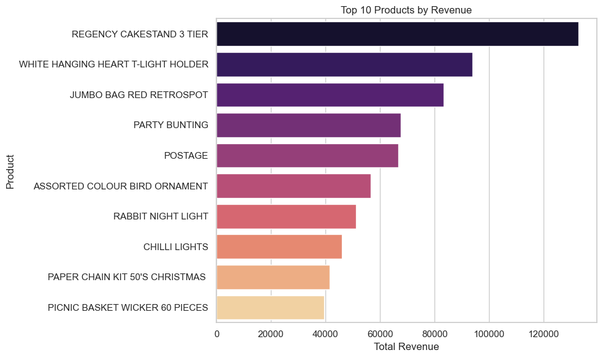
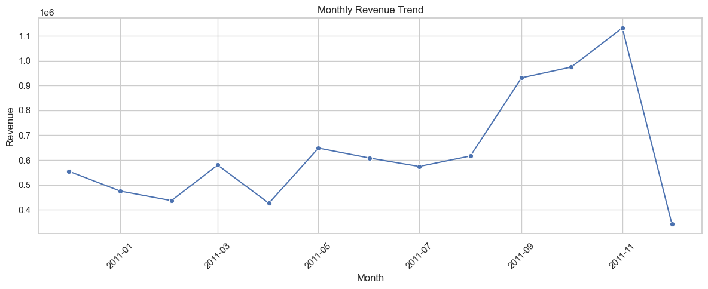
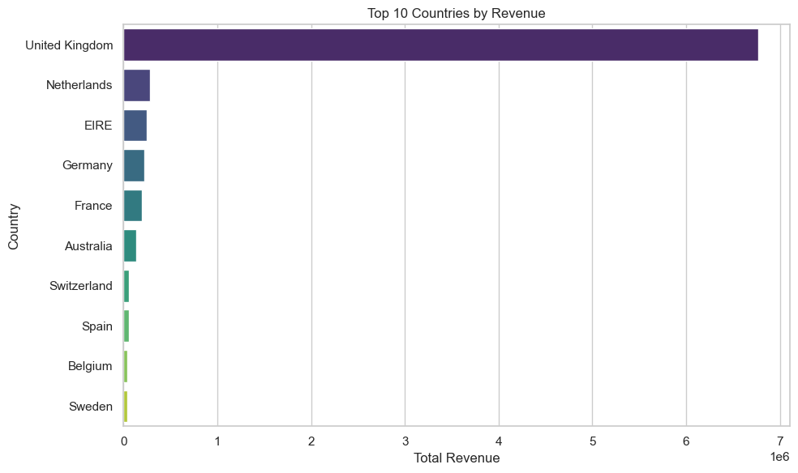

# 🛍️ E-Commerce Sales Data Analysis

This project analyzes sales data from a UK-based e-commerce store to uncover key business insights. Using Python and SQL (via pandasql), I explored purchasing trends, top-performing products, and revenue patterns across time and regions.

## 📌 Overview

I worked with a real-world transactional dataset containing invoices, product details, customer IDs, and order timestamps. The goal was to answer common business questions through data analysis and present the results in a clear, visual format.

## 🛠️ Tools Used

- Python (pandas, matplotlib, seaborn)
- SQL (pandasql for SQL-style querying)
- Jupyter Notebook (Anaconda)

## 🔍 Key Questions Answered

- How much total revenue did the store generate?
- Which products brought in the most revenue?
- How did sales trend month over month?
- Which countries placed the most orders?

## 📊 Final Insights (Dashboard)

- **Top-selling products** accounted for a significant portion of total revenue
- **United Kingdom** was by far the largest market
- **Revenue spikes** were observed around November–December (holiday season)
- **Monthly revenue trend** showed seasonal buying behavior

All charts and tables are included at the end of the notebook in a dashboard-style summary.

## 📁 Project Files

| File | Description |
|------|-------------|
|  Sales_Analysis.ipynb | Full notebook with analysis and visualizations |
|  ecommerce_sales.csv | The dataset used in this project | https://www.kaggle.com/datasets/carrie1/ecommerce-data?resource=download |
|  Sales_Analysis.html | HTML version for direct viewing |
|  README.md | Project summary and documentation |

## 💡 How to Run This

1. Clone the repository or download the files
2. Open `Sales_Analysis.ipynb` using Jupyter Notebook
3. Run the cells step by step to explore the dataset and visuals

## 🧠 What I Learned

- How to clean and transform raw sales data
- Using SQL queries on DataFrames with `pandasql`
- Creating meaningful plots using seaborn
- Structuring and documenting a project for portfolio use

## 📊 Sample Visuals

### 🔹 Top Products by Revenue

### 🔹 Monthly Revenue Trend

### 🔹 Top Countries by Revenue

## 📌 Project Type

| 📊 Exploratory Data Analysis | 🔍 SQL & Python | 📈 Visual Reporting

